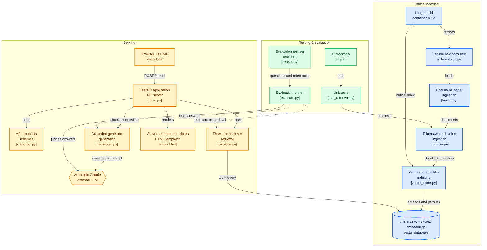

# TensorFlow-RAG


Retrieval-augmented Q&A over the [TensorFlow guide documentation](https://github.com/tensorflow/docs/tree/master/site/en/guide). Ask a question in plain English, get an answer grounded only in the ingested docs, with sources cited.

**Live demo:** [tf-rag.onrender.com](https://tf-rag.onrender.com/) – bring your own Anthropic API key (see [Bring-your-own-key](#what-this-project-is-about) below). Free-tier hosting, so it spins down after 15 minutes idle; the first request after that takes ~30-60s to wake back up.

---

## What this project is about 

A small, complete RAG system built to explore the full pipeline end to end rather than just call an LLM with some context stapled on:

- **Structure-aware chunking** – splits documents by token count while never breaking a fenced code block across chunks, with token-based overlap between chunks for continuity.
- **Local embeddings + vector search** – ChromaDB's bundled ONNX Runtime embedding function (`all-MiniLM-L6-v2`) for embeddings and as the vector store, so the whole thing runs without a GPU-flavored ML stack.
- **Grounded generation** — Claude (via Anthropic's API) answers strictly from retrieved chunks, refusing to answer when nothing relevant is retrieved (distance-thresholded) instead of hallucinating.
- **LLM-as-judge evaluation harness** — a hand-built question set checks both retrieval accuracy (did we fetch the right source doc) and answer accuracy (judged by a second Claude call against a reference summary), including negative examples that should be correctly refused.
- **Bring-your-own-key** – the web UI never touches a server-side API key; each visitor supplies their own Anthropic key client-side, so the demo can be public without anyone spending your API budget.

---

## Architecture



---

## Demo / Preview 


---

## Project structure 

```
src/
  ingest/        # load raw docs (.md / .ipynb), chunk them
    loader.py
    chunker.py
  retrieval/      # vector store (Chroma, ONNX embeddings) + top-k retrieval
    vector_store.py
    retriever.py
  generation/     # prompt construction + Claude call + HTML sanitization
    generator.py
  eval/           # eval question set + retrieval/answer accuracy harness
    testset.py
    evaluate.py
  api/            # FastAPI app, HTMX chat UI, JSON API
    main.py
    schemas.py
    templates/
    static/
tests/            # unit tests (chunker)
data/raw/guide/   # source docs (not committed — see setup below)
chroma_data/      # persisted vector store (not committed — generated locally)
Dockerfile        # self-contained image: installs deps, fetches docs, builds the vector store 
                  at build time
```

---

## Tech stack 

- **Backend:** FastAPI, ChromaDB (ONNX Runtime embeddings), tiktoken
- **Frontend:** Jinja2, HTMX, Tailwind (CDN)
- **Model:** Claude (Anthropic) for generation and as the eval judge
- **Testing / CI:** pytest, GitHub Actions
- **Deployment:** Docker, Render

---

## Getting started

### 1. Clone and install

```bash
git clone https://github.com/nicolasarmientor/tf-rag.git
cd tf-rag
python3 -m venv venv && source venv/bin/activate
pip install -r requirements.txt
```

### 2. Get the source documentation

The raw TensorFlow guide docs aren't committed to this repo. Pull them from the official docs repo and drop the `guide` folder into `data/raw/`:

```bash
git clone --depth 1 https://github.com/tensorflow/docs.git /tmp/tf-docs
cp -r /tmp/tf-docs/site/en/guide data/raw/guide
```

### 3. Configure your API key (optional at this stage)

```bash
cp .env.example .env
# then edit .env and set ANTHROPIC_API_KEY
```

This is only needed for the evaluation script and the JSON `/ask` endpoint — the web UI lets each user supply their own key instead, so you can skip this if you're only running the chat UI.

### 4. Build the vector store

```bash
python -m src.retrieval.vector_store
```

This loads every `.md`/`.ipynb` file under `data/raw/guide`, chunks it, embeds the chunks, and persists them to `chroma_data/`. Only needs to be re-run when the source docs change.

### 5. Run the app

```bash
uvicorn src.api.main:app --reload
```

Open `http://localhost:8000`, paste an Anthropic API key into the settings panel, and ask a question.

---

## Deployment

The `Dockerfile` builds a self-contained image — it fetches the source docs and builds the vector store at image build time, so the container needs no external data or mounted volumes at runtime. It also runs as a non-root user and stays deliberately dependency-light (no torch), which keeps the running process to roughly **~180MB RAM**, comfortably inside free-tier limits:

```bash
docker build -t tf-rag .
docker run -p 8000:8000 tf-rag
```

The live demo above is deployed on [Render](https://render.com)'s free tier (no billing card required), connected directly to this repo's `main` branch — pushing to `main` triggers a redeploy automatically. Render injects a `PORT` environment variable at runtime, which the Dockerfile's `CMD` already reads (`--port ${PORT:-8000}`), so no platform-specific changes were needed.

---

## Usage

1. Open the app and click the settings icon to paste in your Anthropic API key (stored only in your browser's session storage).
2. Type a question about TensorFlow into the chat box (e.g. *"What is a Keras Sequential model?"*).
3. The app retrieves the most relevant chunks from the guide docs, asks Claude to answer using only that context, and renders the answer with the source document(s) it drew from.
4. Ask something outside the ingested docs (e.g. about PyTorch) and it should say it doesn't have enough information rather than guessing — this behavior is what `src/eval/evaluate.py` checks for automatically.

### Run the tests

```bash
pytest
```

### Run the evaluation

```bash
python -m src.eval.evaluate
```

Requires `ANTHROPIC_API_KEY` in `.env`. Reports retrieval accuracy and answer accuracy across the hand-built question set in `src/eval/testset.py`, including cases that should be correctly refused as out-of-scope.

---

## API

- `POST /ask-ui` — form endpoint backing the chat UI, renders an HTML fragment (question + api_key).
- `POST /ask` — JSON API, uses the server-side `ANTHROPIC_API_KEY` (`{"question": "...", "top_k": 5}` → answer + sources).

---

## Development notes

- Chunking is token-aware (via `tiktoken`) rather than character-aware, and deliberately widens a chunk boundary to the end of a code block instead of cutting through it – code samples are common in the TensorFlow guide and splitting them mid-block made retrieved context far less useful.
- Retrieval applies a distance threshold rather than always returning the top-k results, so an irrelevant question yields no usable context and the model is forced to say so instead of answering from unrelated chunks.
- Generated answer HTML is passed through `bleach` before being rendered, since it's model output being injected into a page.
- The API key is intentionally never persisted server-side for the UI flow — see [BYOK support](src/generation/generator.py) — trading a bit of convenience for not being a custodian of anyone's API key.
- Embeddings run through ChromaDB's bundled ONNX Runtime model instead of loading `sentence-transformers`/`torch` directly — same underlying `all-MiniLM-L6-v2` weights (verified the raw query distances are identical between the two), but without a multi-GB GPU-flavored dependency tree. Dropped idle memory from ~465MB to ~180MB, which is what makes free-tier hosting viable at all.
- The Docker image runs as a non-root user, created and `chown`'d *after* the build-time steps that need to write into `/app` (copying source, cloning the docs, building the vector store) rather than before — switching users too early breaks those steps with permission errors. `HOME` is also pinned to `/app` for the whole image, so a cache written during the build (ChromaDB's ONNX model download) is still reachable once the container drops to the non-root user at runtime — otherwise the app would silently re-download that model on every cold start.

---

## Credits

- Source documentation: [tensorflow/docs](https://github.com/tensorflow/docs)
- Embedding model: [sentence-transformers/all-MiniLM-L6-v2](https://huggingface.co/sentence-transformers/all-MiniLM-L6-v2), served via ChromaDB's bundled ONNX Runtime export
- Generation & judge model: [Anthropic Claude](https://www.anthropic.com/)
- Vector store: [ChromaDB](https://www.trychroma.com/)
- Hosting: [Render](https://render.com)

---

## License

This project is licensed under the [MIT license](LICENSE). You are free to use, modify, and distribute this project, provided that the original license and copyright notice are included.
